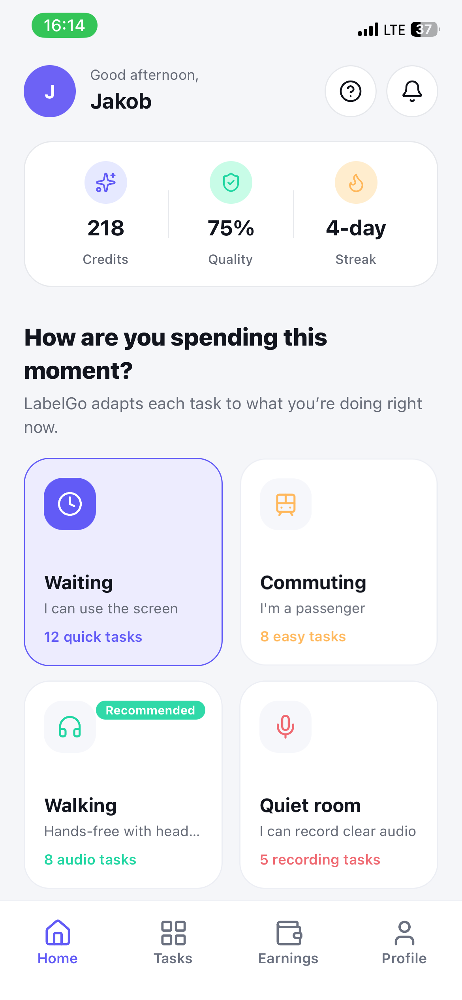
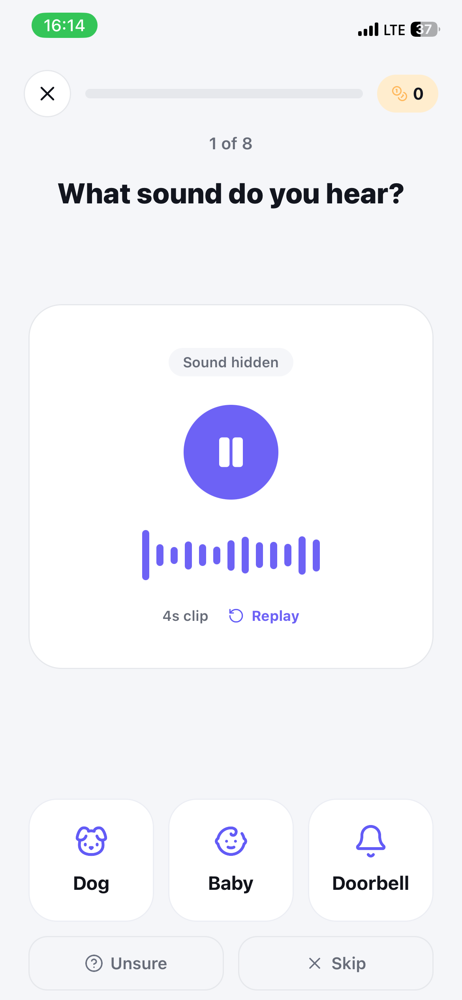
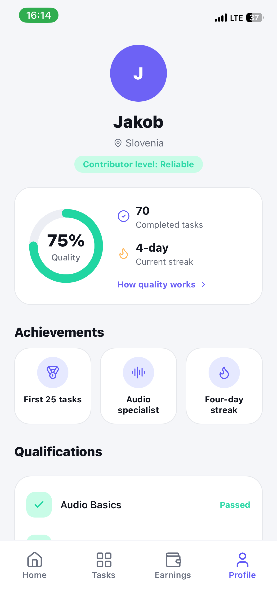

# LabelGO

### Turn spare moments into high-quality data — and earnings.

**LabelGO makes data labeling as easy as answering a question on your phone.**
People can contribute wherever they are, while companies get the human-verified data their AI needs.

 

  
  
  

## The opportunity hiding in everyday time

People spend countless small moments waiting, commuting, or walking with headphones on. Most of that time disappears without creating value. At the same time, companies building AI face a persistent bottleneck: obtaining reliable, human-labeled data at scale.

LabelGO connects both sides of that equation.

## One app. Two problems solved.

### For contributors: make spare time count

Open LabelGO and start in seconds. No complicated workflow, no specialist setup—just short, clear tasks matched to the moment. Label a sound while waiting, contribute on the commute, or complete tasks hands-free while walking with headphones.

Each completed task builds a visible record of quality, reliability, achievements, and earnings. Contributors do meaningful work, grow their reputation, and turn previously idle time into an opportunity.

### For companies: data they can trust

Companies get a flexible, engaged community of contributors producing human-verified labels. LabelGO's quality signals and contributor progress make reliability visible, giving teams a better path from raw data to AI-ready datasets.

## What makes LabelGO different

- **Frictionless from the first tap.** Contributors can begin labeling without learning a complex tool.
- **Built for real life.** Tasks adapt to whether someone is waiting, commuting, in a quiet room, or going hands-free.
- **Human quality is part of the experience.** Clear progress, qualifications, and achievement signals help reward care—not just speed.
- **A win for both sides.** Contributors gain an accessible way to earn; companies gain the labeled data they need to build better AI.

## A labeling experience people actually want to return to

LabelGO turns repetitive data work into a lightweight, motivating routine: listen, identify, contribute, improve. The interface keeps each task focused and approachable, while progress and streaks make every contribution feel tangible.

## Our vision

We believe the next generation of AI data collection should not feel like a barrier between people and opportunity. It should fit naturally into everyday life.

**LabelGO transforms spare moments into trusted human insight—anywhere, and even hands-free.**
